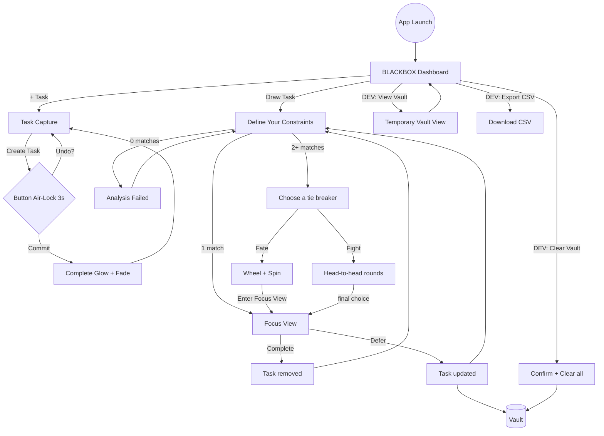
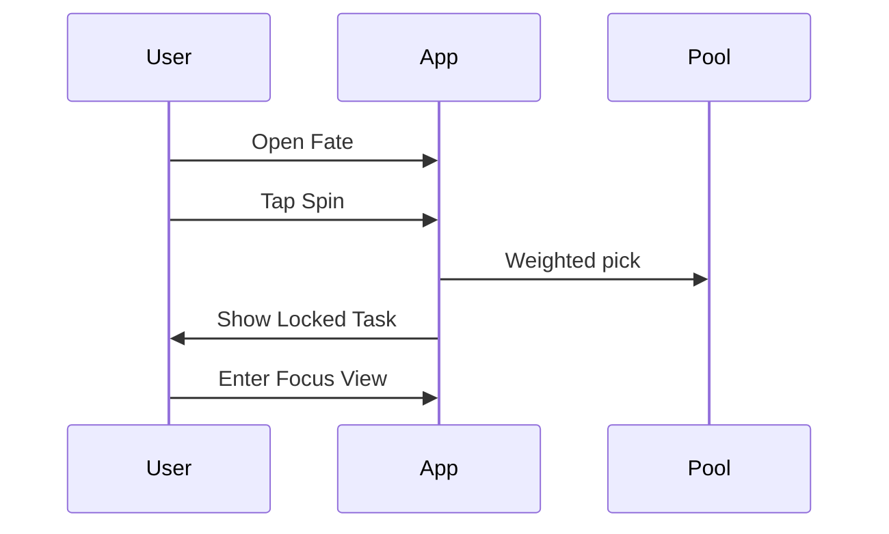
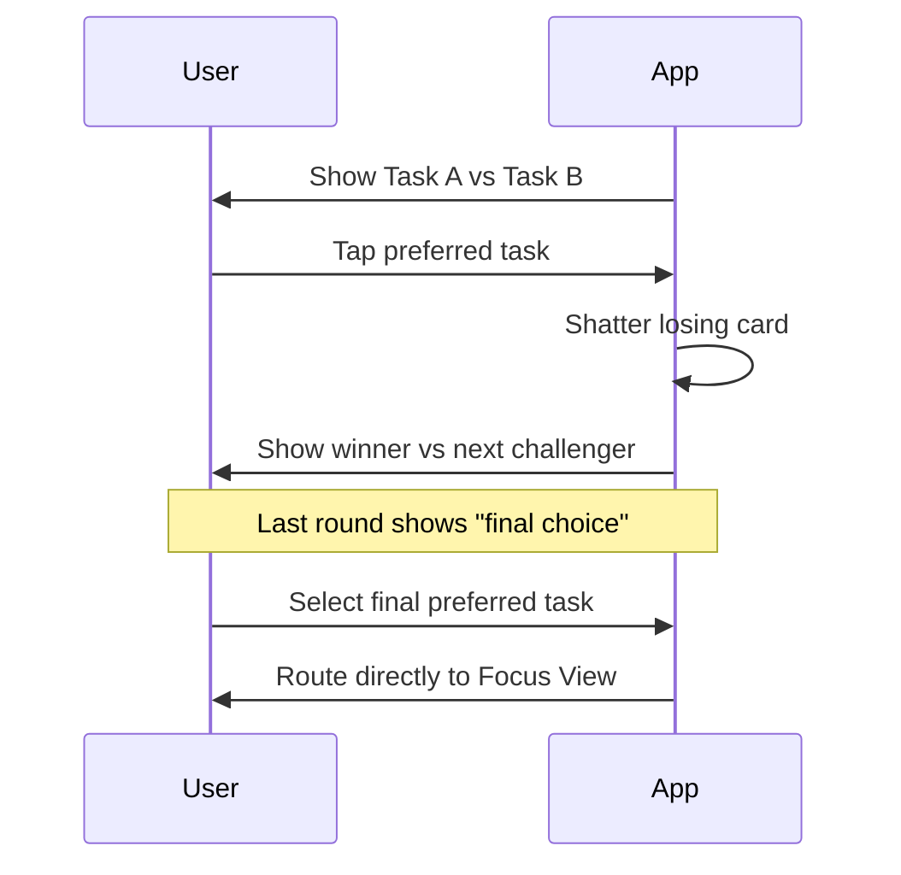

# User Flows: Blackbox

This document reflects current implemented behavior.

## 1. Global Lifecycle

## 2. Capture Flow (`+ Task`)

| Step | Action | UI Result |
| :--- | :--- | :--- |
| 1 | Enter title | Placeholder `Task title`; auto-resize; max 100 chars. |
| 2 | Optional details | Toggle `+ Description` to open `Task description`. |
| 3 | Set constraints | Choose `Time`, `REQUIRED ENERGY`, and one or more `Context`. |
| 4 | Submit | Tap `Create Task`; button becomes `Undo?` with orange fill timer. |
| 5 | Commit complete | On timer end, button shows glowing `Complete`, fades, then resets to `Create Task`. |

Notes:
- Timer duration is 3 seconds.
- During undo sequence, the form remains editable so the next task can be prepared.
- User stays on capture screen after successful commit.
- Character count appears only at limit.
- Duplicate-risk warning appears for similar titles.

## 3. Calibration Flow (`Draw Task`)

| Step | Action | UI Result |
| :--- | :--- | :--- |
| 1 | Open calibration | Heading: `Define Your Constraints`. |
| 2 | Select constraints | Multi-select `Time`, `CURRENT ENERGY`, `Context(s)`. |
| 3 | Run | `Next` executes local filtering. |
| 4 | Fallback | If 0 matches: `Analysis Failed` + retry by adjusting constraints. |
| 5 | Route | 1 match goes to Focus; 2+ matches go to Crucible. |

## 4. Tie-Breaking

### 4.1 Fate

### 4.2 Fight

## 5. Focus Flow

| Action | Result |
| :--- | :--- |
| `Complete` | White flash, task removed, return to calibration. |
| `Defer` | Increment defer count, refresh timestamp, return to calibration. |

If `deferCount >= 3`, a warning banner appears.

## 6. Dev Utility Flow

These controls appear on dashboard view only, fixed in the top-right outside the dashboard card.

| Control | Behavior |
| :--- | :--- |
| `DEV: View Vault` | Opens temporary vault visibility screen. |
| `DEV: Export CSV` | Downloads all vault tasks as CSV. |
| `DEV: Clear Vault` | Confirmation prompt, then clears all tasks. |
