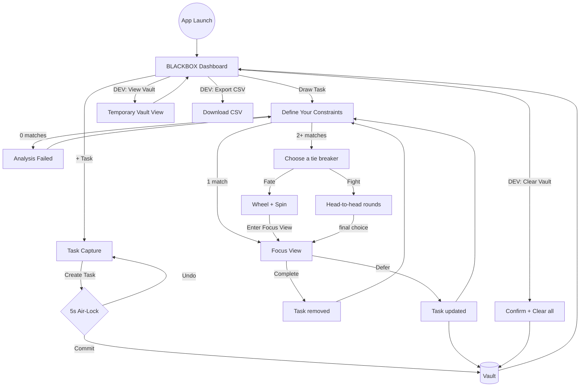
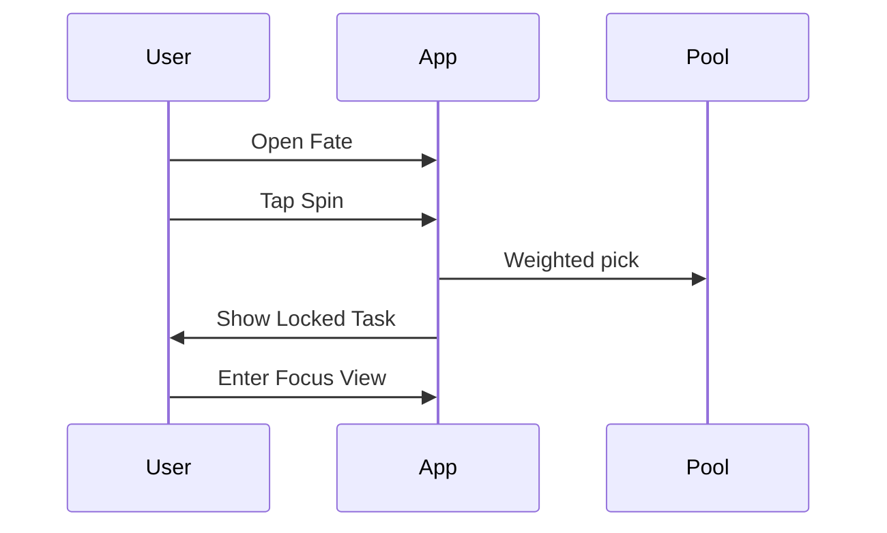
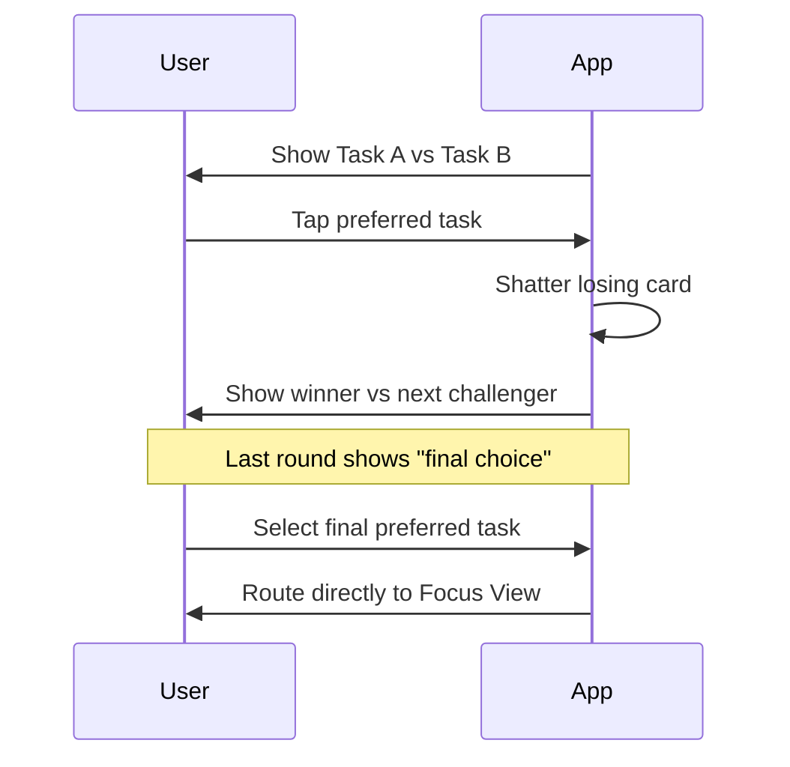

# User Flows: Blackbox

This document describes the current end-to-end behavior implemented in the app.

## 1. Global Lifecycle

## 2. Capture Flow (`+ Task`)

| Step | Action | UI Result |
| :--- | :--- | :--- |
| 1 | Enter title | Placeholder is `Task title`; field auto-resizes; max 100 chars. |
| 2 | Optional details | Toggle `+ Description` to open description input. |
| 3 | Set required constraints | Pick single `Time`, single `REQUIRED ENERGY`, and one or more `Context`. |
| 4 | Create task | Click `Create Task` to open 5-second Air-Lock. |
| 5 | Commit or cancel | `Undo` returns to capture; otherwise task is committed to vault. |

Notes:
- Character count appears only when title reaches the limit.
- Duplicate-risk warning appears when title similarity is high.

## 3. Calibration Flow (`Draw Task`)

| Step | Action | UI Result |
| :--- | :--- | :--- |
| 1 | Open calibration | Screen title: `Define Your Constraints`. |
| 2 | Select constraints | Multi-select `Time`, `CURRENT ENERGY`, `Context(s)`. |
| 3 | Run | `Next` runs matching logic. |
| 4 | Fallback | If 0 matches: `Analysis Failed` + adjust and retry. |
| 5 | Route | 1 match goes straight to Focus; 2+ matches go to Crucible. |

## 4. Tie-Breaking Flow

### 4.1 Fate

### 4.2 Fight

## 5. Focus Flow

| Action | Result |
| :--- | :--- |
| `Complete` | White flash, task removed from vault, return to calibration. |
| `Defer` | Increment defer count, refresh timestamp, return to calibration. |

If `deferCount >= 3`, a warning banner appears in Focus.

## 6. Dev Utility Flow (Dashboard)

| Control | Behavior |
| :--- | :--- |
| `DEV: View Vault` | Opens temporary vault visibility screen. |
| `DEV: Export CSV` | Downloads all vault tasks as CSV. |
| `DEV: Clear Vault` | Confirmation prompt, then clears all tasks. |
